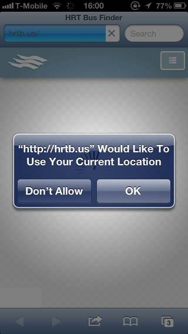
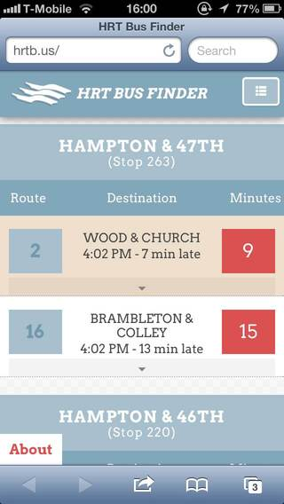
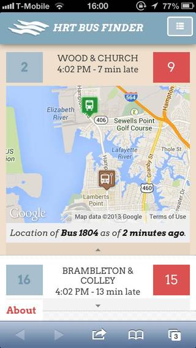
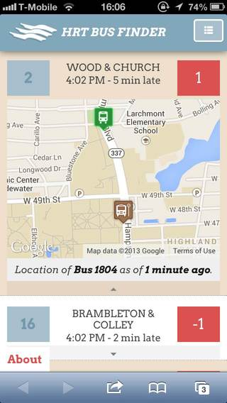
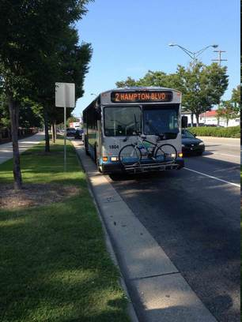

HRT-BUS-FINDER
==============

Introduction
---------------
HRTB.US uses the GTFS Feed from HRT to return the current active buses in Hampton Roads. The application can be used on your smartphone or computer, anytime, anywhere. 	

Quick Start
-------------
***Visit the URL http://hrtb.us***	

***Allow the app to see your current location***	
	

***Look up the stop, the top information, you would like to use*** 	
	
***Click on the bus route you would like to ride to pull the map***	
***The red box will tell you how far your bus is away***	

***Check in real time how far your bus is away***	

***Bus is here, Enjoy! *** 	
			
